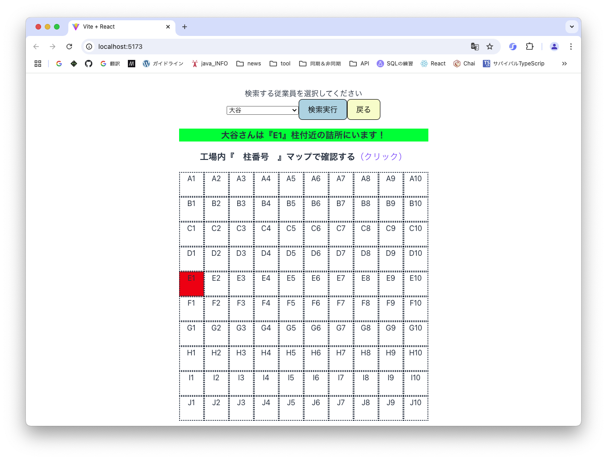

># BTC7 Solo Project
>>## 従業員の詰所を検索するページです。

>## ページイメージ
| トップ画面                   | 検索画面                       | マップ表示 |
|-------------------------|----------------------------|-------|
|  |  ||

>## 準備
*ローカルディレクトリにクローンする
```sh
git@github.com:MasatsuguYamada/BTC7_soloProject.git
```
*依存関係のインストール（バックエンド）

```sh
npm install
```
*依存関係のインストール（フロントエンド）
```sh
cd frontend
```
```sh
npm install
```


